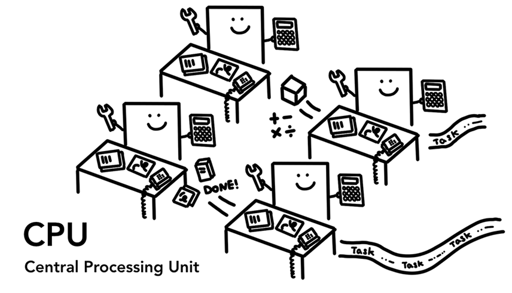

# Inside look at modern web browser (part 1)

原文地址：[https://developer.chrome.com/blog/inside-browser-part1/](https://developer.chrome.com/blog/inside-browser-part1/)。

## CPU, GPU, Memory, and multi-process architecture

CPU, GPU, 内存 和 多线程架构

In this 4-part blog series, we’ll look inside the Chrome browser from high-level architecture to the specifics of the rendering pipeline. If you ever wondered how the browser turns your code into a functional website, or you are unsure why a specific technique is suggested for performance improvements, this series is for you.

在这个系列的 4 篇博客中，我们将从高层次架构(high-level architecture)聊起，一直说到渲染流水线(rendering pipeline)的细节。如果你曾经疑问过，浏览器是如何将你的代码转化为有功能的网站，或者你不确定为什么某一技术(specific technique)是建议使用来优化性能的，那这个系列的文章就会很对你口味。

As part 1 of this series, we’ll take a look at core computing terminology and Chrome’s multi-process architecture.

作为系列的第一篇文章，我们先来聊一聊核心的计算机术语，以及 Chrome 的多线程架构。

## At the core of the computer are the CPU and GPU

计算机的核心 - CPU 和 GPU。

In order to understand the environment that the browser is running, we need to understand a few computer parts and what they do.

为了了解浏览器运行的环境，我们需要先搞明白几个计算机组件，以及它们的作用。

### CPU

First is the **C**entral **P**rocessing **U**nit - or CPU. The CPU can be considered your computer’s brain. A CPU core, pictured here as an office worker, can handle many different tasks one by one as they come in. It can handle everything from math to art while knowing how to reply to a customer call. In the past most CPUs were a single chip. A core is like another CPU living in the same chip. In modern hardware, you often get more than one core, giving more computing power to your phones and laptops.

首先是 CPU(Central Processing Unit)——中央处理器，可以理解为计算机的大脑。CPU 的内核，就像图片中的办公室员工，可以串行依次处理一个个传入的任务。他功能强大，上知天文下知地理，琴棋书画无所不能。以前 CPU 往往只有一块内核，如今的硬件往往包含多个内核，多内核为你的电脑和手机带来了更加强大的处理能力。

### GPU

**G**raphics **P**rocessing **U**nit - or GPU is another part of the computer. Unlike CPU, GPU is good at handling simple tasks but across multiple cores at the same time. As the name suggests, it was first developed to handle graphics. This is why in the context of graphics "using GPU" or "GPU-backed" is associated with fast rendering and smooth interaction. In recent years, with GPU-accelerated computing, more and more computation is becoming possible on GPU alone.

GPU(Graphics Processing Unit)——图形处理器，计算机的另一部分。与 CPU 不同，GPU 擅长处理同时在多个内核进行的简单任务。正如名字说明的，GPU 起初是为处理图像而设计的。

When you start an application on your computer or phone, the CPU and GPU are the ones powering the application. Usually, applications run on the CPU and GPU using mechanisms provided by the Operating System.
